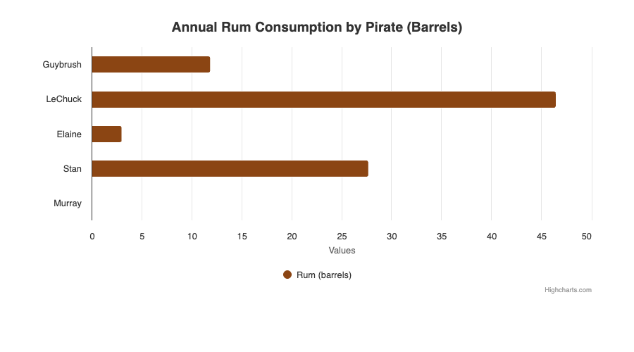
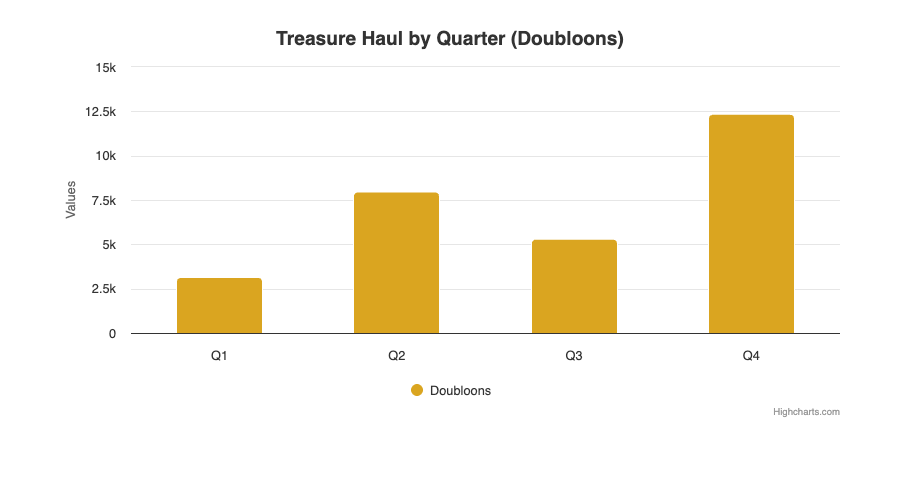
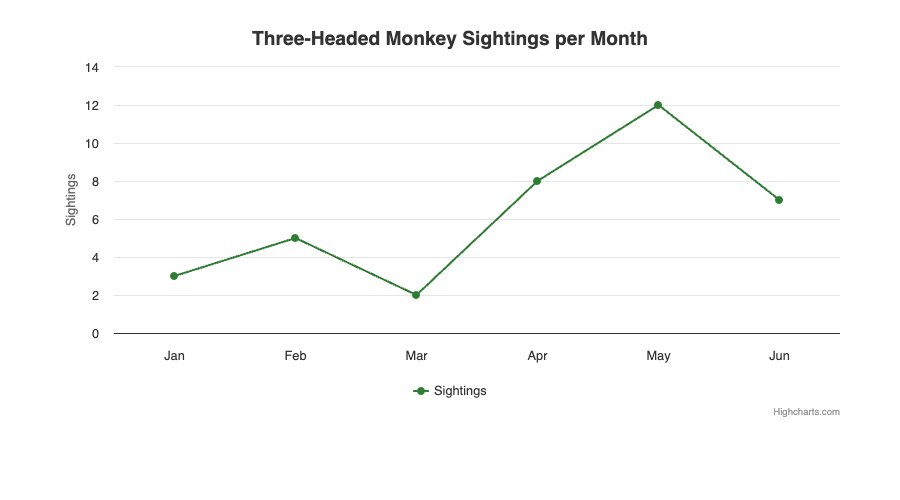
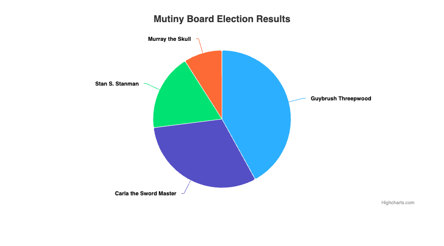
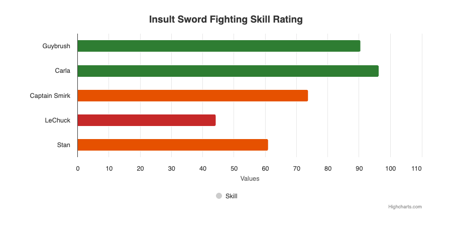
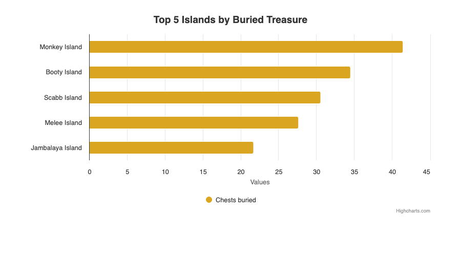
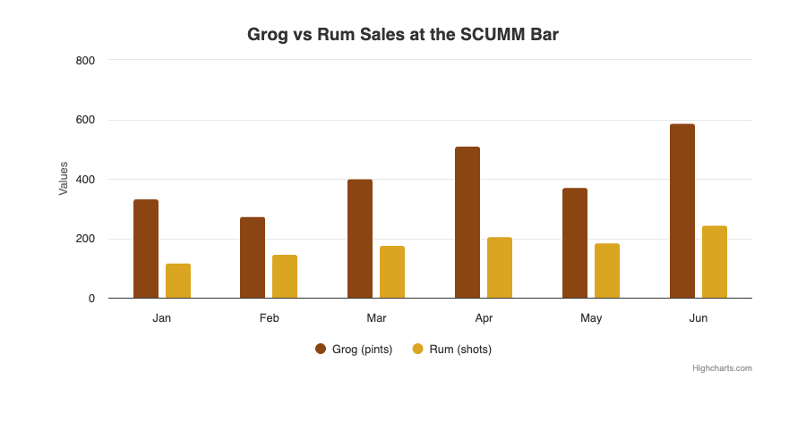

<p align="center">
  
  <br /><br />
  
</p>

<h3 align="center">Write YAML, get Highcharts. Efficient assembly of dashboards on well-grounded rails.</h3>

<p align="center">
  <a href="https://trevl.trendence.com">DSL Documentation</a> &middot;
  <a href="notebooks/demo.ipynb">Demo Notebook</a> &middot;
  <a href="https://github.com/trendence/trevl">GitHub</a>
</p>

---

[Trendence](https://www.trendence.com) is a Berlin-based HR data and analytics company. We believe data visualization should be modern, AI-ready, and accessible. That's why we've been building TREVL -- the **TR**Endence **V**isualization **L**anguage -- a custom DSL designed to make chart creation as simple as writing a few lines of YAML. A language humans easily can use and robots love.

## AI-First Design

TREVL is built for humans and machines. Every feature is designed so that LLMs can generate, validate, and iterate on visualizations autonomously:

- **`Trevl.schema_reference`** -- compact reference (~1500 tokens) optimized for system prompts
- **`Trevl.validate(yaml)`** -- structured error feedback for self-correction loops
- **`Trevl.examples`** -- 10 annotated examples for few-shot learning
- **`Trevl::DataSource.for("name").field_names("endpoint")`** -- discover available data fields
- **[`llms.txt`](llms.txt)** -- machine-readable reference in the repo root
- **JSON Schema** -- formal validation for editors, CI, and AI agents

```ruby
# 1. Discover: what fields does this endpoint return?
Trevl::DataSource.for("myapi").field_names("salary")
# => ["q10", "q50", "q90"]

# 2. Reference: get the compact TREVL spec for a system prompt
Trevl.schema_reference
# => "# TREVL — TREndence Visualization Language\n..."

# 3. Examples: few-shot learning material
Trevl.examples.first
# => {name: "bar_chart", description: "Simple bar chart...", yaml: "..."}

# 4. Validate: catch errors before rendering
Trevl.validate(yaml).errors
# => ["[my_chart] Missing required field(s): api, highchartsData (at )"]

# 5. Render: YAML → Highcharts JSON
Trevl.render(yaml)
```

## Features

- **Declarative YAML** -- define charts, scores, tables, and filters without writing JavaScript
- **Pluggable data sources** -- REST APIs, CubeJS, static/in-memory data, or build your own
- **Computed fields** -- per-row JavaScript transformations via ExecJS
- **Postprocess** -- full-dataset transforms (sort, filter, aggregate) in JavaScript
- **Template inheritance** -- share chart styles with deep merge
- **JSON Schema validation** -- catch errors before rendering
- **iRuby notebooks** -- render interactive Highcharts directly in Jupyter
- **Fully offline** -- bundled Highcharts JS, no CDN needed
- **Standalone** -- no Rails, no framework dependencies

## Installation

```ruby
gem "trevl", github: "trendence/trevl"
```

**Prerequisites:** Ruby >= 3.1, Node.js (`brew install node`) for computed fields.

## Quick Start

```ruby
require "trevl"

# 1. Register a data source
Trevl::DataSource.register("demo", Trevl::DataSource::Static.new(
  data: {
    "pirates" => {
      "data" => [
        {"name" => "Guybrush",  "barrels" => 12},
        {"name" => "LeChuck",   "barrels" => 47},
        {"name" => "Elaine",    "barrels" => 3},
        {"name" => "Stan",      "barrels" => 28},
        {"name" => "Murray",    "barrels" => 0}
      ]
    }
  }
))

# 2. Render
results = Trevl.render(<<~YAML)
  components:
  - id: rum_consumption
    type: chart
    api: demo
    highchartsData:
      chart:
        type: bar
      title:
        text: Annual Rum Consumption by Pirate (Barrels)
      colors: ["#8B4513"]
      series:
      - name: Rum (barrels)
        data:
          x: "$pirates.data.name"
          y: "$pirates.data.barrels"
YAML

# 3. Done -- results.first["highchartsData"] is ready for Highcharts
```

<p align="center">
  
</p>

## Examples Gallery

<table>
<tr>
<td></td>
<td></td>
</tr>
<tr>
<td></td>
<td></td>
</tr>
<tr>
<td></td>
<td></td>
</tr>
</table>

See [`examples/`](examples/) for the YAML source of each chart.

## HTML Export

Render TREVL to an HTML file:

```ruby
html = Trevl.render_to_html(yaml, width: 1000, height: 500)
File.write("chart.html", html)
```

The output is a complete HTML document that pulls Highcharts from the CDN. Point `highcharts_path` at a local copy (see [Highcharts](#highcharts)) and it is embedded inline instead, which makes the file self-contained and usable offline. Open it in any browser, or take a screenshot for AI agents:

```ruby
# Grover gem (Puppeteer wrapper)
Grover.new(html).to_png

# Ferrum (Chrome DevTools Protocol)
browser = Ferrum::Browser.new
browser.content = html
browser.screenshot(path: "chart.png")

# Playwright MCP (for AI agents)
# browser_navigate → browser_take_screenshot
```

## iRuby Notebooks

```ruby
require "trevl"
require "trevl/notebook"

nb = Trevl::Notebook.new

nb.chart(<<~YAML, data: {"salary" => {"data" => [...]}})
  components:
  - id: chart
    type: chart
    api: static
    highchartsData:
      chart:
        type: column
      series:
      - data:
          x: "$salary.data.level"
          y: "$salary.data.value"
YAML
```

Highcharts is bundled -- charts render offline. See [`notebooks/demo.ipynb`](notebooks/demo.ipynb) for 5 working examples.

## Data Sources

### Static (in-memory)

```ruby
Trevl::DataSource.register("mydata", Trevl::DataSource::Static.new(
  data: {"endpoint" => {"data" => [...], "meta" => {...}}}
))
```

### REST API

```ruby
Trevl::DataSource.register("myapi", Trevl::DataSource::Api.new(
  base_url: "https://api.example.com/v1",
  auth: Trevl::Auth::BearerToken.new(ENV["API_TOKEN"])
))
```

### CubeJS

```ruby
Trevl::DataSource.register("cube", Trevl::DataSource::Cube.new(
  url: "https://cube.example.com/cubejs-api/v1",
  token: ENV["CUBE_TOKEN"]
))
```

### Custom

```ruby
class MySource < Trevl::DataSource::Base
  def fetch(endpoint, params = {}, resource: nil)
    {"data" => MyDB.query(endpoint, params), "meta" => {}}
  end
end

Trevl::DataSource.register("db", MySource.new)
```

### Per-render injection

Instead of registering globally, pass data directly to a render call.
Per-render data takes precedence over the registry and never touches shared
state — the right choice when the data differs per request (e.g. web apps
serving concurrent users).

For inline rows, pass the raw hash as `data:` — it answers any `api:` name in
the document, and components may omit `api:` entirely:

```ruby
Trevl.render(yaml, data: {"scores" => rows_for_this_request})
Trevl.render_to_html(yaml, data: {"scores" => rows_for_this_request})
```

For full control (multiple sources, API/Cube instances), pass `data_sources:`
— entries win over `data:` for their name:

```ruby
source = Trevl::DataSource::Api.new(base_url: "https://api.example.com/v1")

Trevl.render(yaml, data_sources: {"mydata" => source})
```

## Validation

Validate TREVL YAML before rendering — catch errors early, not at render time.

```ruby
result = Trevl.validate(<<~YAML)
  components:
  - id: my_chart
    type: chart
YAML

result.valid?   # => false
result.errors   # => ["[my_chart] Missing required field(s): api, highchartsData (at )"]
```

Powered by [JSON Schema (draft 2020-12)](lib/trevl/schema/component.json) -- covers all 5 component types with conditional validation. The schema files work standalone in VS Code, CI pipelines, or any JSON Schema-compatible tool.

Ideal for AI agents: generate TREVL, validate, self-correct, render.

Full docs: [trevl.trendence.com/validation](https://trevl.trendence.com/validation)

## YAML Reference

### Component Types

| Type | Description |
|------|-------------|
| `chart` | Highcharts visualization (bar, column, line, pie, ...) |
| `score` | Single KPI value with optional unit |
| `table` | Data table with column definitions |
| `text` | Static text / HTML content |
| `filter` | Filter options bound to data |

### Variable References

```yaml
"$endpoint.data.fieldName"             # data row field
"$endpoint.meta.fieldName"             # metadata field
"$resource.endpoint.data.fieldName"    # with resource qualifier
"$computedFieldName"                   # computed field shorthand
```

### Computed Fields

Per-row JavaScript expressions:

```yaml
computed:
- name: color
  arguments:
    val: "$salary.data.value"
  code: 'val > 60000 ? "#003F85" : "#ccc"'
```

### Postprocess

Full-dataset JavaScript transforms:

```yaml
postprocess: |
  $result = $result
    .sort((a, b) => b.value - a.value)
    .slice(0, 10);
```

### Templates

```ruby
Trevl.template_store.register("blue_bar", {
  "highchartsData" => {
    "chart" => {"type" => "bar"},
    "colors" => ["#003F85"]
  }
})
```

```yaml
- id: my_chart
  template: blue_bar
  highchartsData:
    title:
      text: My Chart
```

Deep merge: component overrides template at the same path.

## Auth

```ruby
# Bearer token
auth = Trevl::Auth::BearerToken.new("token")

# Custom -- any object with #apply(headers, url:)
class MyAuth
  def apply(headers, url: nil)
    headers["Authorization"] = "Bearer #{fetch_token}"
  end
end
```

## Configuration

```ruby
Trevl.configure do |c|
  c.logger = Logger.new($stdout, level: :info)
  c.template_store = my_custom_store
end
```

## Highcharts

TREVL produces Highcharts configuration; it does not ship Highcharts. Highcharts is
commercial software by [Highsoft](https://www.highcharts.com/license) and is
deliberately not bundled here, so using it requires your own licence.

`Trevl.render` returns plain configuration hashes and never touches Highcharts at all.
Only the HTML export and the notebook display load it, and by default they reference
the CDN:

```ruby
Trevl.configure do |c|
  c.highcharts_url = "https://code.highcharts.com/11.4.0/highcharts.js"  # default
  c.highcharts_modules = ["https://code.highcharts.com/11.4.0/highcharts-more.js"]
end
```

Set `highcharts_path` to a local file and it gets inlined instead of linked, which is
what you want for offline use or air-gapped rendering:

```ruby
Trevl.configure do |c|
  c.highcharts_path = "/opt/highcharts/highcharts.js"
end
```

`highcharts_modules` accepts URLs and local paths under the same rule: a path is
inlined, a URL is referenced.

### In a Rails app

If your app already renders charts, it almost certainly ships Highcharts through the
asset pipeline. In that case, do nothing: pass the hash from `Trevl.render` to your
existing frontend and let the bundle you already load draw it.

```ruby
components = Trevl.render(yaml, data: {"rows" => rows})
# hand components.first["highchartsData"] to your Stimulus controller
```

Only the server-side HTML export needs its own copy. The leanest way to give it one is
to reuse the file the asset pipeline already has:

```ruby
# config/initializers/trevl.rb
Trevl.configure do |c|
  local = Rails.root.join("vendor/javascript/highcharts.js")
  c.highcharts_path = local if local.exist?
end
```

Without that initializer the export falls back to the CDN, which is fine for anything
that renders in a browser with network access.

## Development

```bash
bin/setup              # install dependencies
bundle exec rspec      # 140 specs
bundle exec standardrb # lint
bin/console            # interactive console
```

## Language Specification

The full TREVL v3.0 specification lives at **[trevl.trendence.com](https://trevl.trendence.com)** -- covering component schemas, query definitions, filter operators, computed fields, postprocess patterns, template inheritance, and data source integration.

## License

MIT -- see [LICENSE](LICENSE).

Highcharts is not covered by that licence and is not distributed with this project.
Using it requires a licence from Highsoft; see [NOTICE](NOTICE) and
[highcharts.com/license](https://www.highcharts.com/license).
